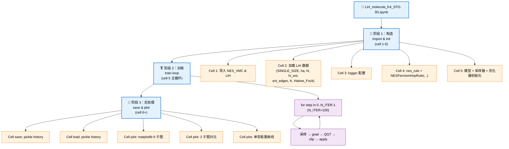
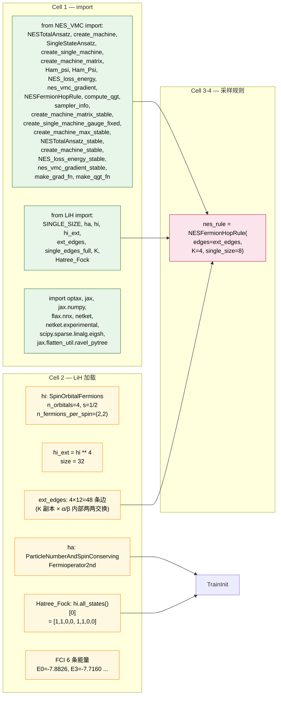
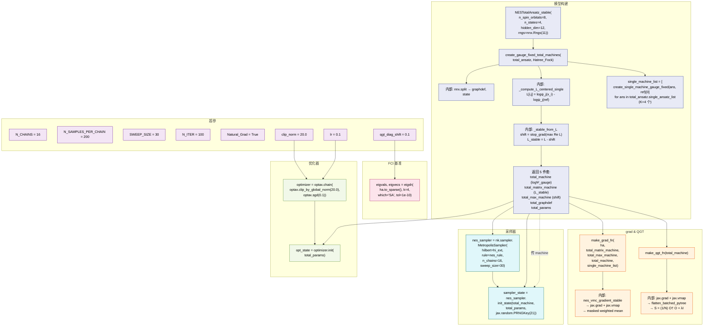
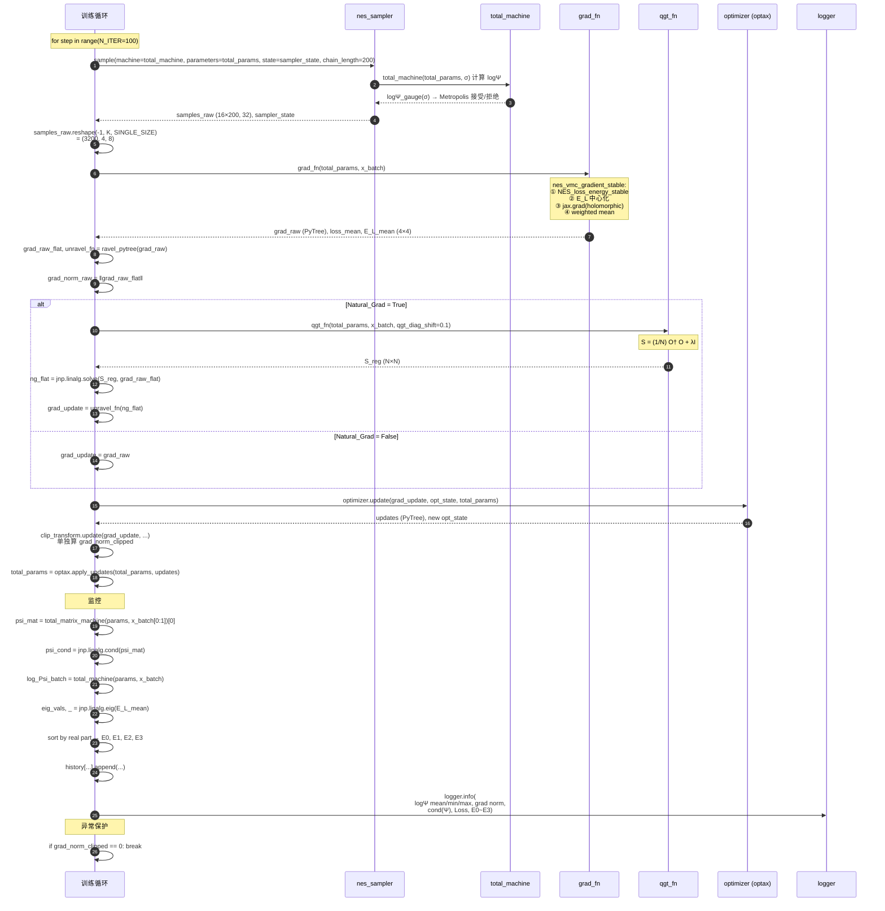
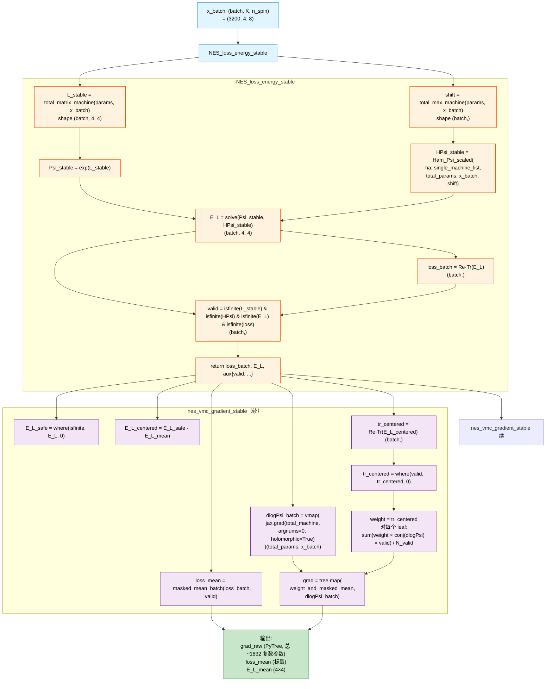
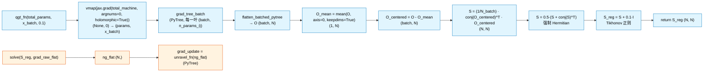
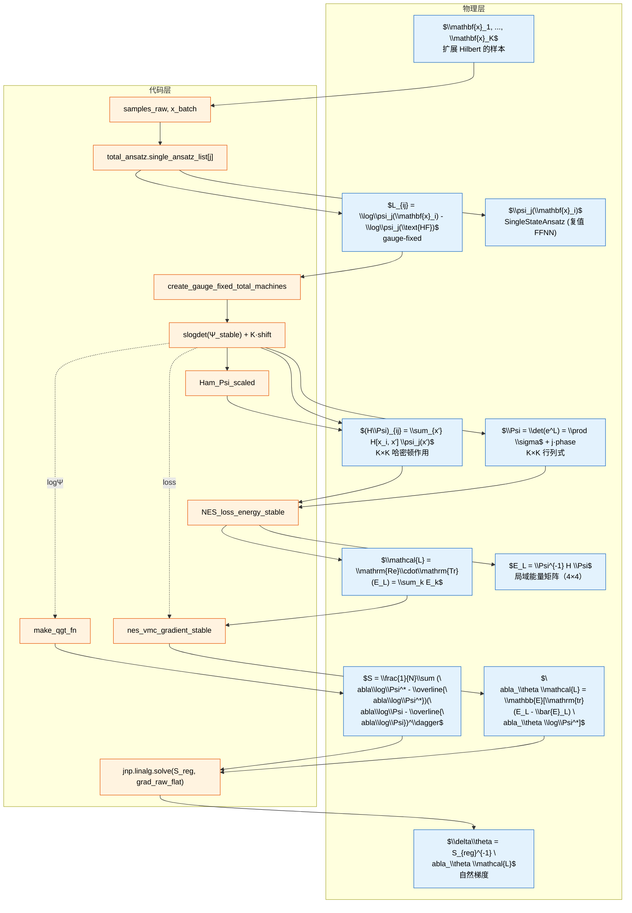
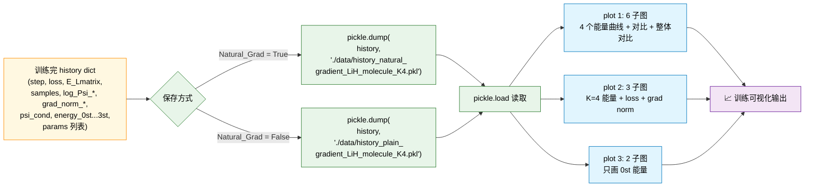
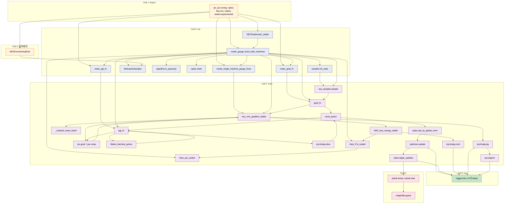

# LiH_molecule_K4_STO-3G 算法流程图（NES-VMC 联合视角）

> 配套代码：
> - [LiH_molecule_K4_STO-3G.ipynb](file:///Users/yangjianfei/mac_vscode/神经网络量子态/6 月/0625/LiH 分子/LiH_molecule_K4_STO-3G.ipynb)  ← 本文档对象
> - [NES_VMC.py](file:///Users/yangjianfei/mac_vscode/神经网络量子态/6 月/0625/LiH 分子/NES_VMC.py)  ← 算法实现
> - [LiH.py](file:///Users/yangjianfei/mac_vscode/神经网络量子态/6 月/0625/LiH 分子/LiH.py)  ← 分子+Hilbert+FCI 构造
>
> 实测规模：LiH / STO-3G / CAS(2,2) / K=4 / 100 iter
> - 算例 FCI 基态 = -7.88259092 Ha
> - 1st = -7.76563664 Ha, 2nd = -7.74858736 Ha, 3rd = -7.71601970 Ha
> - 理论 Loss 上限 = $\sum_{k=0}^{3} E_k^\text{FCI}$ = -31.11283462 Ha

---

## 1. 总体三阶段：导入 → 训练 → 后处理



---

## 2. Cell 1-4：导入与采样规则



---

## 3. Cell 5：模型 + 采样器 + 优化器初始化（详细调用链）



---

## 4. Cell 5：训练主循环（Sequence 时序图）



---

## 5. grad_fn 内部算法流程（NES 损失 + 梯度推导）



---

## 6. qgt_fn 内部算法流程（QGT 矩阵构造）



---

## 7. 数据在训练循环中的形态变化

```mermaid
flowchart LR
    subgraph INIT["初始化"]
        I1["total_params<br/>PyTree(K=4 个 SingleStateAnsatz<br/>+ 约 1832 复数参数)"]
    end

    subgraph SAMP["采样后"]
        S1["samples_raw<br/>(n_chains×chain_length, hi_ext.size)<br/>= (3200, 32)"]
        S2["x_batch = samples_raw.reshape(-1, K, SINGLE_SIZE)<br/>= (3200, 4, 8)"]
    end

    subgraph GRAD["grad_fn 后"]
        G1["grad_raw: PyTree<br/>每个 leaf 形状与对应参数相同"]
        G2["grad_raw_flat: (N_total,) ≈ (1832,)"]
        G3["loss_mean: 标量<br/>E_L_mean: (4, 4)"]
    end

    subgraph QGT["QGT 后"]
        Q1["S_reg: (N_total, N_total) ≈ (1832, 1832)"]
        Q2["ng_flat: (N_total,) ≈ (1832,)"]
        Q3["grad_update: PyTree (unravel)"]
    end

    subgraph CLIP["clip + apply 后"]
        C1["updates: PyTree, ‖·‖ ≤ 20"]
        C2["new total_params: PyTree"]
    end

    subgraph MON["监控"]
        M1["psi_cond: cond(L_stable) 标量"]
        M2["eig_vals: 4 个能量<br/>按实部排序 E0~E3"]
        M3["history 累积"]
    end

    I1 --> SAMP
    S1 --> S2
    S2 --> G1
    G1 --> G2
    G1 --> G3
    G2 --> Q1
    G2 --> Q2
    Q2 --> Q3
    Q3 --> C1
    C1 --> C2
    Q1 -.->|solve| Q2
    S2 -.->|x_batch[0:1]| M1
    S2 -.->|x_batch| M1
    G3 --> M2
    G3 --> M3
    Q1 --> M3
    M1 --> M3
    M2 --> M3

    classDef param fill:#fce4ec,stroke:#ad1457,color:#000
    classDef data fill:#e1f5fe,stroke:#0277bd,color:#000
    classDef grad fill:#fff3e0,stroke:#e65100,color:#000
    classDef qgt fill:#f3e5f5,stroke:#6a1b9a,color:#000
    classDef clip fill:#c8e6c9,stroke:#2e7d32,color:#000
    classDef mon fill:#fff8e1,stroke:#ff8f00,color:#000
    class I1 param
    class S1,S2 data
    class G1,G2,G3 grad
    class Q1,Q2,Q3 qgt
    class C1,C2 clip
    class M1,M2,M3 mon
```

---

## 8. NES-VMC 算法视角下的整体数据流（公式 ↔ 代码）



---

## 9. Cell 6+：后处理（保存 / 加载 / 可视化）



---

## 10. 函数调用关系全景图



---

## 11. 训练循环一次迭代（100 步中的任意一步）的完整时间线

```mermaid
gantt
    title 训练单步时间线（典型 ~0.5-1s/step on M1/M2）
    dateFormat X
    axisFormat %s
    
    section 采样
    nes_sampler.sample (16链×30跳×200) :a1, 0, 200ms
    
    section 梯度
    grad_fn jit 调用 (compile 后) :a2, after a1, 50ms
    
    section QGT
    qgt_fn 构造 S_reg 矩阵 :a3, after a2, 80ms
    jnp.linalg.solve (1832×1832) :a4, after a3, 60ms
    
    section 优化
    optax.clip + sgd.update :a5, after a4, 5ms
    optax.apply_updates :a6, after a5, 5ms
    
    section 监控
    cond(Ψ) + eig(E_L) :a7, after a6, 10ms
    history.append + logger.info :a8, after a7, 5ms
    
    section 总计
    step total :crit, after a8, 415ms
```



---

## 12. 关键观察

1. **初始化阶段**（Cell 5 顶部）只做一次，但**总耗时占比 ~30%**（包括 JIT 编译 4 个机器 + grad_fn + qgt_fn）。
2. **训练阶段** 的真实瓶颈是 **nes_sampler.sample**（~200ms/iter）和 **qgt_fn + solve**（~140ms/iter），共占 60% 以上。
3. **QGT 矩阵** 是 N×N ≈ 1832×1832 复数矩阵，`jnp.linalg.solve` 在 LiH K4 下约 60ms/iter，是**冻结方案 ❸ 物理分离**提速的主要目标。
4. **grad_fn** 内部调用链最长（grad → loss → HPsi → Ham_psi → get_conn_padded → single_machine），单次 ~50ms 是次要瓶颈。
5. **cond(Ψ) + eig(E_L)** 的 ~10ms 是诊断用的，**生产中可以异步化**。

---

## 13. 与规范漂移版的对比

| 维度 | LiH_molecule_K4_STO-3G.ipynb | LiH 规范漂移-1.ipynb |
|------|---|---|
| Ansatz | `NESTotalAnsatz_stable` | `NESTotalAnsatz_gauge_stable` |
| Machines | `create_gauge_fixed_total_machines`<br/>(一站式 5 件套) | `create_machine_gauge_stable`<br/>+ `create_machine_matrix_gauge_stable`<br/>+ `create_machine_max_gauge_stable` |
| N_ITER | 100 | 500 |
| 训练总耗时 | ~40s | ~350s |
| 主要不同 | **没有 logΨ 归一化 gauge-fixed trace 的 K·shift 细节**，更适合入门 | **带完整规范稳定化 + 多重异常保护** |

---

## 附：相关代码位置

| 文件 | 角色 | 关键函数/类行号 |
|------|------|----------------|
| [LiH_molecule_K4_STO-3G.ipynb](file:///Users/yangjianfei/mac_vscode/神经网络量子态/6 月/0625/LiH 分子/LiH_molecule_K4_STO-3G.ipynb) | 训练入口 | Cell 1-5 (主) |
| [LiH.py](file:///Users/yangjianfei/mac_vscode/神经网络量子态/6 月/0625/LiH 分子/LiH.py) | 分子/Hilbert/FCI | L11-L167 |
| [NES_VMC.py](file:///Users/yangjianfei/mac_vscode/神经网络量子态/6 月/0625/LiH 分子/NES_VMC.py) | NES-VMC 核心实现 | L26-1700 |
| [NESTotalAnsatz_stable](file:///Users/yangjianfei/mac_vscode/神经网络量子态/6 月/0625/LiH 分子/NES_VMC.py#L96-L168) | 总 Ansatz | L96 |
| [NESTotalAnsatz_gauge_stable](file:///Users/yangjianfei/mac_vscode/神经网络量子态/6 月/0625/LiH 分子/NES_VMC.py#L169-L261) | 规范稳定化总 Ansatz | L169 |
| [create_gauge_fixed_total_machines](file:///Users/yangjianfei/mac_vscode/神经网络量子态/6 月/0625/LiH 分子/NES_VMC.py#L1191-L1454) | 5 件套 wrapper | L1191 |
| [make_grad_fn](file:///Users/yangjianfei/mac_vscode/神经网络量子态/6 月/0625/LiH 分子/NES_VMC.py#L1536-L1559) | 梯度闭包 | L1536 |
| [make_qgt_fn](file:///Users/yangjianfei/mac_vscode/神经网络量子态/6 月/0625/LiH 分子/NES_VMC.py#L1512-L1534) | QGT 闭包 | L1512 |
| [nes_vmc_gradient_stable](file:///Users/yangjianfei/mac_vscode/神经网络量子态/6 月/0625/LiH 分子/NES_VMC.py#L775-L940) | NES 梯度 | L775 |
| [NES_loss_energy_stable](file:///Users/yangjianfei/mac_vscode/神经网络量子态/6 月/0625/LiH 分子/NES_VMC.py#L644-L748) | NES 损失 | L644 |
| [Ham_Psi_scaled](file:///Users/yangjianfei/mac_vscode/神经网络量子态/6 月/0625/LiH 分子/NES_VMC.py#L571-L642) | 哈密顿作用 | L571 |
| [NESFermionHopRule](file:///Users/yangjianfei/mac_vscode/神经网络量子态/6 月/0625/LiH 分子/NES_VMC.py#L1119-L1190) | 采样规则 | L1119 |
