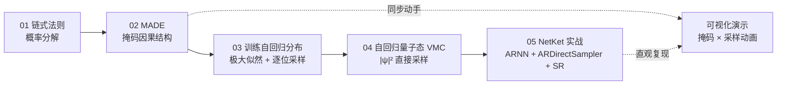

# 自回归神经网络：从链式法则到 NetKet 实战

> 面向读者的起点：已经会用 MLP 搭神经网络、了解 NetKet/VMC 基本流程，正在学习**自回归神经网络**（Autoregressive Neural Network）。
> 全课程一条主线：**把联合分布/波函数按链式法则拆成条件概率连乘，用神经网络逐位建模与采样**。

## 目录结构（6 个文件）

| 文件 | 内容一句话 | 预计学习时间 |
| --- | --- | --- |
| `01-链式法则与自回归分解.ipynb` | 用概率链式法则把联合分布拆成 $P(x_1)\prod_i P(x_i\mid x_{<i})$，建立"逐位生成"的直觉 | 约 30 分钟 |
| `02-MADE-掩码全连接层.ipynb` | 手写 MADE：用随机掩码把全连接层"剪"出因果结构——输出 i 永远看不到输入 i | 约 45 分钟 |
| `03-训练自回归分布-采样与似然.ipynb` | 用极大似然训练 MADE 拟合玩具分布，并亲手实现逐位（顺序）采样 | 约 45 分钟 |
| `04-自回归神经网络量子态.ipynb` | 把 $\lvert\psi\rvert^2$ 当概率分布，徒手实现自回归采样 VMC，绕开马尔可夫链 | 约 60 分钟 |
| `05-NetKet中的自回归模型.ipynb` | 用 NetKet 现成的 `ARNNDense` + `ARDirectSampler` + SR 跑临界横场 Ising 链（N=8），相对误差实测 **0.0107%** | 约 45 分钟（含 2.5 分钟训练） |
| `可视化-自回归采样演示.html` | 浏览器直接打开的交互演示：MADE 掩码因果结构可视化 + 6-bit 逐位采样动画（单文件、无网络依赖） | 约 10 分钟 |

## 学习路径



文字版：`01 → 02 → 03 → 04 → 05`，`可视化-自回归采样演示.html` 随时可开（02 课学掩码后、05 课学 ARDirectSampler 后各看一遍收获最大）。

## 每课的核心问题

| 课 | 核心问题 | 学完你会掌握 |
| --- | --- | --- |
| 01 | 联合分布太大（$2^N$ 个构型）怎么办？ | 链式法则分解、条件概率的顺序性、为什么"生成"是逐位的 |
| 02 | 全连接网络怎么保证"输出 i 看不到输入 i"？ | MADE 掩码机制（输入/隐藏/输出三层 mask 规则）、随机掩码排列与集成 |
| 03 | 给了模型，怎么训练、怎么采样？ | 极大似然 = 逐位交叉熵、并行算全部条件概率、串行逐位采样；偏差-方差直觉 |
| 04 | 量子态 $P(x)=\lvert\psi(x)\rvert^2$ 不是归一化的，还能逐位采吗？ | 归一化常数在条件概率比值中消去、自回归 VMC 完整流程、能量估计与误差条 |
| 05 | 现成轮子怎么用？出了错怎么自己查？ | introspect 库 API（dir/signature/docstring）、NetKet ARNN 系列、`ARDirectSampler` vs `MetropolisSampler`、本环境实测可用的 SR 配置 |

## 环境说明

- Python：`/opt/miniconda3/envs/Netket/bin/python`
- 关键依赖：`netket 3.21.0`、`jax 0.9.2`（版本敏感，05 课的 SR 配置与之绑定）
- 运行 notebook：
  ```bash
  /opt/miniconda3/envs/Netket/bin/python -m jupyter nbconvert --to notebook --execute --inplace 05-NetKet中的自回归模型.ipynb
  ```
- 05 课全流程实测约 **2 分 15 秒**（N=8、512 样本、300 步）；本环境已知的三个坑（详见 05 课"踩坑记录"）：
  1. `nk.models.MADE` 在 netket 3.21 中已不存在 → 用 `ARNNDense`；
  2. 默认 SR 与 jax 0.9.2 冲突 → 用 `nk.optimizer.SR(qgt=nk.optimizer.qgt.QGTJacobianDense(holomorphic=False), solver=nk.optimizer.solver.svd, diag_shift=0.01)`；
  3. `FastARNN*` 系列在本环境 JIT 下报错 → 不使用。

## 一句话总结：自回归 vs 传统 MLP-NQS

**传统 MLP-NQS** 只把网络当"能量函数"用，采样仍靠 Metropolis 马尔可夫链慢慢磨（burn-in + 自相关）；**自回归 NQS** 则把 $|\psi|^2$ 写成条件概率连乘，让采样变成"逐位精确生成"——每一步只问一次"下一位取 1 的概率是多少"，样本严格独立、无需 burn-in，这就是 `ARDirectSampler` 存在的全部理由。
